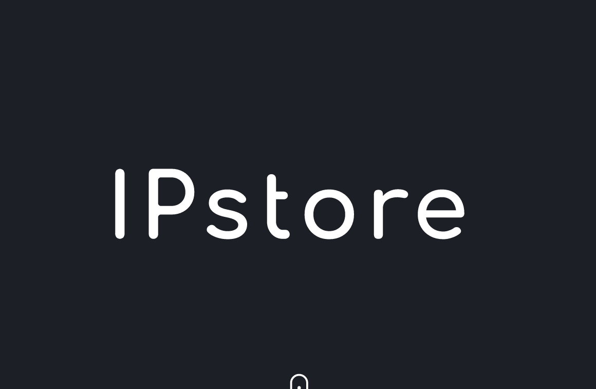
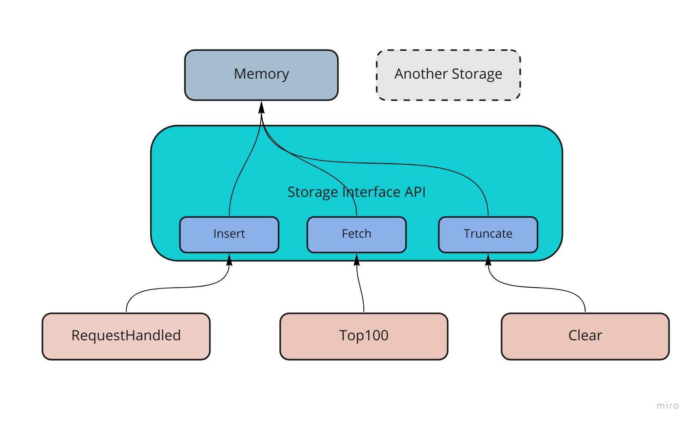

Package IPStore
=================

Reliably log, store and count ingress IP addresses.
------------



**IPStore** is a library for keeping track of IP addresses that make request to your service. 


[](https://github.com/teezzan/cdenv/blob/master/LICENSE.md)


Features
------------

- Light-Weight
- Fast Insert and Fetch Operations
- Validation of inputs
- Modular and extendable for any kind of storage

Example Code
------------

Using this library is as simple as running the following 
```golang
package main

import 	"github.com/teezzan/ipstore"

func main() {
	 // Stores the IP Address 192.34.56.321 in the memory storage
	 ipstore.RequestHandled("192.34.56.321") 
    
	 // Increments the IP Address 192.54.56.333 count by 1.
	 ipstore.RequestHandled("192.34.56.321") 

	 // Fetch the top 100 frequent IP addresses
	 top100 := ipstore.Top100()
	 
	 // Removes all stored IP addresses. 
	 ipstore.Clear()
}

```

Installation
------------

Use go get.

	go get github.com/teezzan/ipstore

Then import  IPstore library into your own code.

	import "github.com/teezzan/ipstore"


Documentation
----------
The doc for this library can be found on [pkg.go.dev](https://pkg.go.dev/github.com/teezzan/ipstore#pkg-functions).

Architecture
-----------


The modular architecture allows for implementation of the same system using another storage.

Testing
-------

Run `make tests` to run tests. 

Benchmark Results
-----
Ensure you have considerable memory before running the benchmark tests with `make benchmark`. You can also tweak the nunmber of IP addresses to choose from by editing the variable `ipLookupSize` (defaults to a billion) in `./benchmark_test.go`. 

Below is the result of such benchmark.
```bash
goos: linux
goarch: amd64
pkg: github.com/teezzan/ipstore
cpu: Intel(R) Core(TM) i7-6700HQ CPU @ 2.60GHz
BenchmarkRequestHandled-8        1509050               778.6 ns/op
BenchmarkTop100-8                 629430              2316 ns/op
PASS
ok      github.com/teezzan/ipstore   90.634s
```
Contributing
------------
Issues and pull requests are welcome at [IPstore](https://github.com/teezzan/ipstore). This project is intended to be safe, welcoming, and open for collaboration. Users are expected to adhere to the [Contributor Covenant code of conduct](https://www.contributor-covenant.org/version/2/0/code_of_conduct/). We are all human.

## License
This project is licensed under the MIT License - see the [LICENSE.md](LICENSE.md) file for details.

